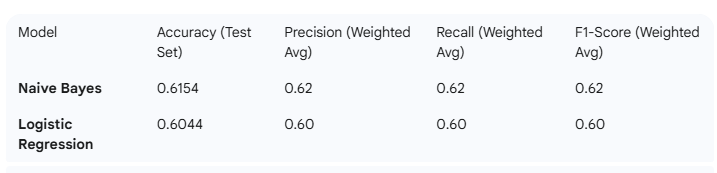
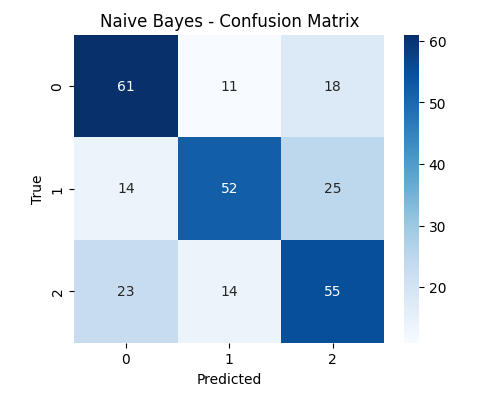
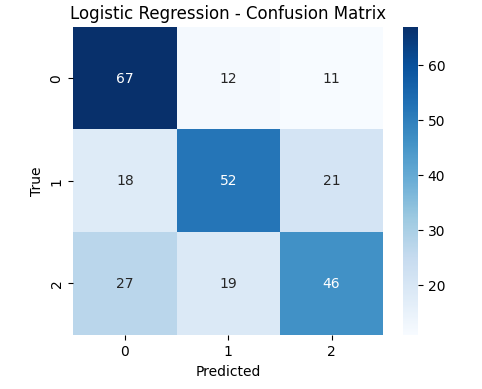

# Sentiment Analysis Capres–Cawapres: Classical ML Comparison (Naive Bayes & Logistic Regression)

# 

This repository contains a Jupyter notebook detailing an end-to-end pipeline for **Sentiment Analysis** on Indonesian text data, specifically focused on Twitter sentiment towards Presidential and Vice-Presidential candidates. The project uses classical machine learning models, **Multinomial Naive Bayes** and **Logistic Regression**, for classification.

## Project Overview

The main goal of this project is to classify Indonesian-language tweets into three sentiment categories: **positive**, **negative**, and **neutral**.

The pipeline covers the initial stages of the Machine Learning lifecycle:

1. **Data Loading & Initial EDA:** Reading the raw dataset and checking class distribution.
2. **Data Cleaning & Label Normalization:** Preprocessing raw tweet text (removing URLs, mentions, emojis, punctuation, etc.) and unifying sentiment labels.
3. **Data Splitting:** Stratified split into training, validation, and test sets (70/15/15).
4. **Feature Engineering (Classical ML):** Using **TF-IDF** (Term Frequency-Inverse Document Frequency) vectorization for classical models.
5. **Model Comparison:** Training and evaluating **Multinomial Naive Bayes** and **Logistic Regression**.

---

## Repository Contents

- `sentiment_rnn_lstm_end_to_end_withLM.ipynb`: The main Jupyter notebook containing the complete analysis and modeling pipeline.
- `tweet.csv`: The raw dataset used for the analysis.

---

## Data Summary: `tweet.csv`

The raw dataset contains **1,815** entries with information about tweets and their corresponding sentiment labels.

| Column Name | Data Type | Description | Example (Row 4) |
| --- | --- | --- | --- |
| `Unnamed: 0` | `int64` | Original index column (to be dropped during preprocessing). | `4` |
| `sentimen` | `object` (string) | The original target label for tweet sentiment. | `negatif` |
| `tweet` | `object` (string) | The raw Indonesian-language tweet text. | `Negara kita ngutang buat bngun infrastruktur yang udah dipake masyarakat, terus masyarakatnya ngeluh karena negara ngutang, setiap negara itu pasti ngutang, utang bisa dibayar kalo negara dapet penghasilan. Penghasilan negara itu ya dari pajak` |

### Class Distribution (Raw/Normalized)

The dataset is highly **balanced**, which is ideal for a multi-class classification problem. The normalization step in the notebook ensures these labels are consistent (`negatif` $\rightarrow$ `negative`, `positif` $\rightarrow$ `positive`).

| Label | Count |
| --- | --- |
| **positive** | 612 |
| **neutral** | 607 |
| **negative** | 596 |

---

## Setup and Dependencies

To run this notebook, you will need a Python environment with the following libraries: `pandas`, `numpy`, `scikit-learn`, `matplotlib`, `seaborn`, `tensorflow`, and `nltk`.

### Installation

```bash
pip install pandas numpy scikit-learn matplotlib seaborn tensorflow nltk
```

## 🔬 Modeling & Results (Baseline)

Two baseline classical machine learning models were trained on the TF-IDF vectorized data and evaluated on the test set.





